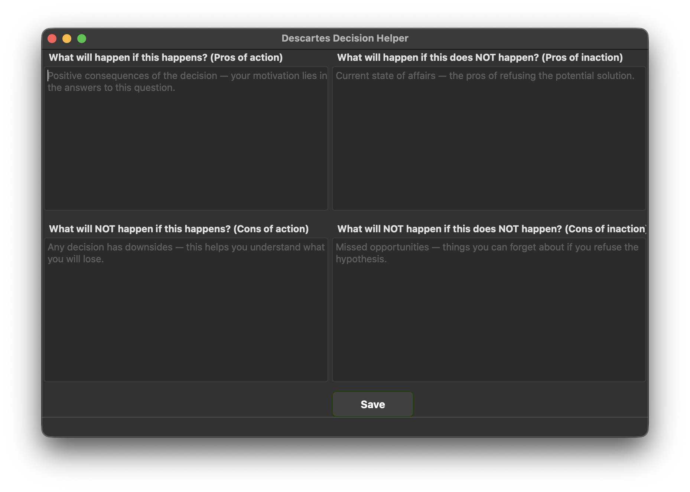

# Descartes Decision Helper

Descartes' Square — Decision Helper


## 📘 How it Works
The application implements the **Descartes Square** decision-making technique. It helps you look at a problem from four different angles:

1. What will happen if this happens? (Pros of action)
2. What will happen if this does NOT happen? (Pros of inaction)
3. What will NOT happen if this happens? (Cons of action)
4. What will NOT happen if this does NOT happen? (Cons of inaction)

The program parses your answers line by line. If you put an importance score (**1 to 5**) after a space at the end of a line, the app will include it in the weighted calculation to provide a final verdict.

---

## 🌍 Languages
The application currently supports:
* Russian (RU)
* English (EN)

---

## 🛠 How to Build (Executable)
To create a standalone executable (`.exe` or `.app`) so that others can run the program without installing Python, use **PyInstaller**.

### 1. Install PyInstaller
```bash
pip install pyinstaller
```

### 2. Build the Application
Run the build command. Note the difference in the `--add-data` separator depending on your operating system:

**For macOS / Linux:**
```bash
python -m PyInstaller --noconsole --onedir --add-data "ui.ui:." main.py
```

**For Windows:**
```bash
python -m PyInstaller --noconsole --onedir --add-data "ui.ui;." main.py
```

### 3. Run the App
Once the process is complete, look inside the newly created `dist/main` folder. You will find your executable file there.